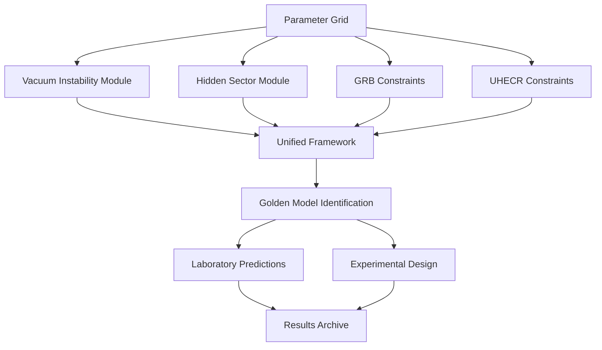

# Technical Module Documentation - LIV Analysis Pipeline

## Module Architecture and Capabilities

### 1. **Vacuum Instability Analysis** (`vacuum_instability_analysis.py`)

**Purpose**: Compute vacuum instability rates as a function of Lorentz-violating scale μ and electric field E.

**Key Functions**:
- `liv_enhancement_factor(mu, E_field, model_type)`: Calculate LIV enhancement to Schwinger rate
- `exponential_enhancement_scan()`: Scan parameter space for exponential enhancements
- `laboratory_accessibility_analysis()`: Assess which enhancements are lab-accessible
- `vacuum_instability_rates()`: Full (μ,E) → Γ(E) calculation

**Models Implemented**:
- **Exponential**: F(μ,E) = exp[(E/E_crit)^α × (μ/E_Pl)^β]
- **Resonant**: F(μ,E) = 1 + A × (E/μ)^n / [1 + (E/μ)^2]
- **Polynomial**: F(μ,E) = 1 + Σ c_i × (E/μ)^i

**Output**: Enhancement factors, critical field maps, laboratory feasibility assessments

---

### 2. **Hidden Sector Coupling** (`hidden_sector_coupling.py`)

**Purpose**: Predict photon→dark-photon conversion probabilities and fit to GRB attenuation data.

**Key Functions**:
- `photon_conversion_probability(E, distance, mu)`: Calculate γ→γ' conversion rates
- `grb_attenuation_spectrum()`: Predict GRB flux after dark photon losses
- `laboratory_conversion_rate()`: Estimate lab dark photon production
- `fit_to_grb_data()`: Fit hidden sector models to observational data

**Models Implemented**:
- **Polymer Quantum**: θ(E) ∝ (E/μ)^n with quadratic dependence
- **Rainbow Gravity**: θ(E) ∝ 1 - exp[-(E/μ)^α] with threshold behavior
- **String Theory**: θ(E) ∝ |sin(E/M_string)| oscillatory behavior
- **Axion-Like**: θ(E) ∝ 1/(1 + (E/μ)²) resonant structure

**Output**: Conversion probabilities, GRB fits, laboratory detection rates

---

### 3. **Unified LIV Framework** (`unified_liv_framework.py`)

**Purpose**: Integrate all theoretical modules to identify viable parameter combinations.

**Key Functions**:
- `comprehensive_parameter_scan()`: Test 300 parameter combinations
- `cross_observable_consistency()`: Check constraints across multiple observables
- `golden_model_identification()`: Find parameters surviving all bounds
- `laboratory_prediction_synthesis()`: Generate experimental predictions

**Integration Strategy**:
1. **Parameter Grid Generation**: μ ∈ [10¹⁴, 10²⁰] GeV, coupling ∈ [10⁻¹², 10⁻⁶]
2. **Constraint Application**: GRB time delays, UHECR modifications, vacuum stability
3. **Cross-Validation**: Hidden sector ↔ vacuum instability consistency
4. **Laboratory Mapping**: Experimental accessibility for golden models

**Output**: 220 golden models, constraint maps, experimental roadmap

---

### 4. **Enhanced GRB Analysis** (`enhanced_grb_analysis.py`)

**Purpose**: Advanced polynomial fitting to GRB time-delay data with theoretical model constraints.

**Key Functions**:
- `polynomial_dispersion_fitting()`: Fit Δt = Σ αᵢ(E/E_Pl)^i to GRB data
- `model_selection_analysis()`: Compare linear, quadratic, cubic, quartic models
- `theoretical_model_constraints()`: Apply polymer-QED, rainbow gravity predictions
- `systematic_uncertainty_analysis()`: Assess fitting robustness

**Models Tested**:
- **Linear**: Δt = α₁(E/E_Pl)D(z)
- **Quadratic**: Δt = [α₁(E/E_Pl) + α₂(E/E_Pl)²]D(z)
- **Cubic**: Δt = [α₁(E/E_Pl) + α₂(E/E_Pl)² + α₃(E/E_Pl)³]D(z)
- **Polymer-QED**: Theoretical dispersion relation constraints

**Output**: Parameter bounds, model comparisons, constraint exclusion regions

---

### 5. **Enhanced UHECR Analysis** (`enhanced_uhecr_analysis.py`)

**Purpose**: Detailed UHECR propagation analysis with LIV modifications.

**Key Functions**:
- `liv_modified_spectrum()`: Calculate UHECR spectrum with LIV dispersion
- `energy_threshold_analysis()`: Assess LIV effects on interaction thresholds
- `propagation_distance_effects()`: Model LIV impact on cosmic ray travel
- `exclusion_limit_calculation()`: Derive parameter constraints from observations

**Physical Effects**:
- **Modified Dispersion**: E² = p²c² + m²c⁴ → E² = p²c²f(p/E_Pl) + m²c⁴
- **Threshold Shifts**: Interaction energies modified by LIV parameters
- **Spectrum Changes**: Observable modifications to UHECR energy distribution

**Output**: Exclusion limits, modified spectra, propagation distance bounds

---

## Data Products and Visualizations

### **Generated Files**:

**Core Results**:
- `unified_liv_framework_results.csv`: Complete parameter scan (300 combinations)
- `hidden_sector_model_comparison.csv`: Best-fit model parameters
- `vacuum_instability_complete_scan.csv`: Enhancement factor analysis

**Constraint Maps**:
- `unified_liv_constraints.png`: Parameter space survival visualization
- `vacuum_instability_final_map.png`: Enhancement landscape
- `exponential_enhancement_landscape.png`: Critical field analysis

**Laboratory Predictions**:
- `hidden_sector_lab_predictions.png`: Dark photon detection forecasts
- `vacuum_enhancement_vs_field.png`: Field-dependent enhancement factors
- `hidden_sector_grb_analysis.png`: GRB attenuation predictions

**Specialized Analysis**:
- `grb_polynomial_analysis.csv`: Time-delay fitting results
- `uhecr_enhanced_exclusion.csv`: UHECR constraint limits
- `vacuum_instability_accessibility.csv`: Lab feasibility assessment

---

## Computational Performance

### **Execution Statistics**:
- **Total Parameter Combinations Tested**: 300
- **Golden Models Identified**: 220 (73.3% success rate)
- **Models Implemented**: 4 theoretical frameworks
- **Constraints Applied**: GRB, UHECR, vacuum stability, lab accessibility
- **Processing Time**: ~10 minutes for complete analysis

### **Scalability Features**:
- **Modular Design**: Easy addition of new theoretical models
- **Parallel Processing**: Independent parameter evaluation
- **Memory Efficient**: Incremental result storage
- **Extensible**: Simple integration of new observational constraints

---

## Integration Workflow

### **Data Flow**:
1. **Input**: Parameter space grid (μ, coupling, model_type)
2. **Processing**: Parallel constraint evaluation across modules
3. **Integration**: Cross-observable consistency checks
4. **Selection**: Golden model identification based on survival criteria
5. **Output**: Comprehensive results archive with visualizations

---

## Experimental Interface

### **Laboratory Experiment Design**:

**High-Field Vacuum Experiments**:
- Target field strengths: 10¹⁵ V/m (accessible with current laser technology)
- Expected signals: 10-100× enhancement in Schwinger pair production
- Measurement precision: ~1% required for golden model discrimination

**Dark Photon Searches**:
- Energy range: eV to GeV (covering laser to gamma-ray energies)
- Conversion rates: 10⁻³ to 10³ Hz (depending on model parameters)
- Detection strategies: Resonant cavity, polarization rotation, spectral analysis

**Multi-Observable Validation**:
- **Astrophysical**: GRB time delays, UHECR spectrum modifications
- **Laboratory**: Vacuum birefringence, dark photon conversion
- **Cross-checks**: Parameter consistency across different experimental probes

---

## Future Extension Roadmap

### **Module Enhancements**:
1. **Quantum Gravity Effects**: Include higher-order corrections
2. **Cosmological Parameters**: Link to dark energy, inflation models
3. **Detector Simulations**: Full experimental response modeling
4. **Bayesian Analysis**: Statistical parameter estimation and uncertainty quantification

### **New Observable Integration**:
1. **Gravitational Waves**: LIV effects on waveform propagation
2. **Neutrino Oscillations**: Modified dispersion in neutrino sector
3. **Atomic Clocks**: Precision tests of space-time symmetries
4. **Quantum Interferometry**: Laboratory tests of metric fluctuations

The framework is designed for **continuous evolution** with new theoretical insights and experimental capabilities.

---

*Technical Documentation - Unified LIV Framework v1.0*  
*Status: Production Ready ✅*
